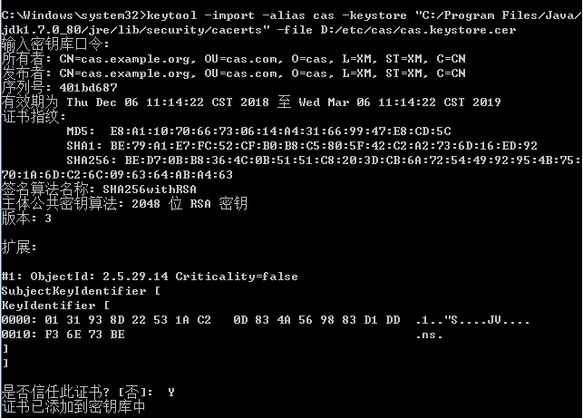

# cas-overlay部署测试

windows 7 环境 jdk1.8 下部署测试cas-overlay-template-5.2


### 服务端-基于静态用户

下载

[cas-overlay-template-5.2.zip](https://github.com/apereo/cas-overlay-template/tree/5.2)

进入到解压开的目录，执行build run

启动失败，报错：

Caused by: java.io.FileNotFoundException: **\etc\cas\thekeystore** (系统找不到指定的
文件。)

运行之前需要先生成keystore文件

```
https://github.com/apereo/cas-overlay-template/tree/5.2

Deployment
Create a keystore file thekeystore under /etc/cas. Use the password changeit for both the keystore and the key/certificate entries.
Ensure the keystore is loaded up with keys and certificates of the server.
```

这里需要创建keystorefile, 参考2: [CAS 5.1.x 的搭建和使用（一）—— 通过Overlay搭建服务端](https://www.cnblogs.com/flying607/p/7598248.html)

C:\Users\gh>keytool -genkey -alias cas -keyalg RSA -keysize 2048 -keypass 123456
 -storepass 123456 -keystore D:/etc/cas/cas.keystore -dname "CN=cas.example.org,
OU=cas.com,O=cas,L=XM,ST=XM,C=CN"

Warning:
JKS 密钥库使用专用格式。建议使用 "keytool -importkeystore -srckeystore D:/etc/ca
s/cas.keystore -destkeystore D:/etc/cas/cas.keystore -deststoretype pkcs12" 迁移
到行业标准格式 PKCS12。

hosts文件加上

```
127.0.0.1 cas.example.org
```

新建src/main/resources目录，设置为资源目录类型

将overlays/org.apereo.cas.cas-server-webapp-tomcat-5.2.6/WEB-INF/classes/application.properties

拷贝到resources目录之下，修改以下配置：

```
server.ssl.key-store=file:/etc/cas/cas.keystore
server.ssl.key-store-password=123456
server.ssl.key-password=123456
```

再执行build run启动，就启动成功了

访问:  https://cas.example.org:8443/cas/

输入casuser/Meloon登录成功


### 服务端-基于mysql

建表

```sql
CREATE TABLE `auth_user` (
  `id` int(11) NOT NULL AUTO_INCREMENT COMMENT '自增主键',
  `name` varchar(255) NOT NULL COMMENT '姓名',
  `account` varchar(255) NOT NULL COMMENT '账号',
  `passwd` varchar(255) NOT NULL COMMENT '密码',
  `mobile` varchar(255) NOT NULL COMMENT '手机',
  `email` varchar(255) NOT NULL COMMENT '邮箱',
  `type` int(255) NOT NULL DEFAULT '0' COMMENT '类型 0-普通用户',
  `status` int(11) NOT NULL DEFAULT '0' COMMENT '状态 0-有效 1-失效',
  `remark` varchar(255) NOT NULL COMMENT '备注',
  `create_time` timestamp NOT NULL DEFAULT CURRENT_TIMESTAMP COMMENT '创建时间',
  `update_time` timestamp NOT NULL DEFAULT CURRENT_TIMESTAMP ON UPDATE CURRENT_TIMESTAMP COMMENT '最后更新时间',
  PRIMARY KEY (`id`),
  UNIQUE KEY `u_account` (`account`)
) ENGINE=InnoDB AUTO_INCREMENT=2 DEFAULT CHARSET=utf8;


```

插入测试用户数据

```sql
INSERT INTO `auth_user` (`id`, `name`, `account`, `passwd`, `mobile`, `email`, `type`, `status`, `remark`, `create_time`, `update_time`) VALUES ('1', 'admin', 'admin', 'admin123', '13306011713', '1', '0', '0', '1', '2018-12-06 14:21:56', '2018-12-06 14:21:56');

```


https://apereo.github.io/cas/5.2.x/installation/JDBC-Drivers.html

引入依赖

```

    <dependencies>
        <dependency>
            <groupId>org.apereo.cas</groupId>
            <artifactId>cas-server-webapp${app.server}</artifactId>
            <version>${cas.version}</version>
            <type>war</type>
            <scope>runtime</scope>
        </dependency>

        <!-- 引入数据库认证相关 start-->
        <dependency>
            <groupId>org.apereo.cas</groupId>
            <artifactId>cas-server-support-jdbc</artifactId>
            <version>${cas.version}</version>
        </dependency>
        <dependency>
            <groupId>org.apereo.cas</groupId>
            <artifactId>cas-server-support-jdbc-drivers</artifactId>
            <version>${cas.version}</version>
        </dependency>
        <dependency>
            <groupId>mysql</groupId>
            <artifactId>mysql-connector-java</artifactId>
            <version>5.1.36</version>
        </dependency>
        <!--数据库认证相关 end-->

    </dependencies>
```


resources/application.properties下

注释掉默认配置

```
# cas.authn.accept.users=casuser::Mellon
```

新增jdbc的配置

https://apereo.github.io/cas/5.2.x/installation/Configuration-Properties.html#database-authentication

```
cas.authn.jdbc.query[0].sql=SELECT * FROM auth_user WHERE account=?
cas.authn.jdbc.query[0].healthQuery=
cas.authn.jdbc.query[0].isolateInternalQueries=false
cas.authn.jdbc.query[0].url=jdbc:mysql://127.0.0.1:3306/shadow?useUnicode=true&characterEncoding=UTF-8&autoReconnect=true&useSSL=false
cas.authn.jdbc.query[0].failFastTimeout=1
cas.authn.jdbc.query[0].isolationLevelName=ISOLATION_READ_COMMITTED
cas.authn.jdbc.query[0].dialect=org.hibernate.dialect.HSQLDialect
cas.authn.jdbc.query[0].leakThreshold=10
cas.authn.jdbc.query[0].propagationBehaviorName=PROPAGATION_REQUIRED
cas.authn.jdbc.query[0].batchSize=1
cas.authn.jdbc.query[0].user=root
# cas.authn.jdbc.query[0].ddlAuto=create-drop
cas.authn.jdbc.query[0].maxAgeDays=180
cas.authn.jdbc.query[0].password=root
cas.authn.jdbc.query[0].autocommit=false
cas.authn.jdbc.query[0].driverClass=com.mysql.jdbc.Driver
cas.authn.jdbc.query[0].idleTimeout=5000
# cas.authn.jdbc.query[0].credentialCriteria=
# cas.authn.jdbc.query[0].name=
# cas.authn.jdbc.query[0].order=0
# cas.authn.jdbc.query[0].dataSourceName=
# cas.authn.jdbc.query[0].dataSourceProxy=false
# Hibernate-specific properties (i.e. `hibernate.globally_quoted_identifiers`)
# cas.authn.jdbc.query[0].properties.propertyName=propertyValue

cas.authn.jdbc.query[0].fieldPassword=passwd
# cas.authn.jdbc.query[0].fieldExpired=
# cas.authn.jdbc.query[0].fieldDisabled=
# cas.authn.jdbc.query[0].principalAttributeList=sn,cn:commonName,givenName

# cas.authn.jdbc.query[0].passwordEncoder.type=NONE|DEFAULT|STANDARD|BCRYPT|SCRYPT|PBKDF2|com.example.CustomPasswordEncoder
# cas.authn.jdbc.query[0].passwordEncoder.characterEncoding=
# cas.authn.jdbc.query[0].passwordEncoder.encodingAlgorithm=
# cas.authn.jdbc.query[0].passwordEncoder.secret=
# cas.authn.jdbc.query[0].passwordEncoder.strength=16

# cas.authn.jdbc.query[0].principalTransformation.pattern=(.+)@example.org
# cas.authn.jdbc.query[0].principalTransformation.groovy.location=file:///etc/cas/config/principal.groovy
# cas.authn.jdbc.query[0].principalTransformation.suffix=
# cas.authn.jdbc.query[0].principalTransformation.caseConversion=NONE|UPPERCASE|LOWERCASE
# cas.authn.jdbc.query[0].principalTransformation.prefix=
```

重新执行build run

用数据库中的用户名密码admin/admin123登录成功


### 客户端-配置运行

https://github.com/cas-projects/cas-sample-java-webapp

下载下来用idea打开，修改web.xml中的配置

[web.xml.patch](web.xml.patch)

然后部署到tomcat运行，这里运行在8080端口。访问

http://localhost:8080

跳转到cas服务器

https://cas.example.org:8443/cas/login?service=http%3A%2F%2Flocalhost%3A8080%2F

报错：

```
未认证授权的服务
CAS的服务记录是空的，没有定义服务。 希望通过CAS进行认证的应用程序必须在服务记录中明确定义。
```

https://apereo.github.io/cas/5.2.x/installation/Configuration-Properties.html#service-registry

https://apereo.github.io/cas/5.2.x/installation/JSON-Service-Management.html

新建以下目录src/main/webapp/WEB-INF/classes/services/，从overlays对应的目录拷贝HTTPSandIMAPS-10000001.json文件到src/main/webapp/WEB-INF/classes/services/之下：

src/main/webapp/WEB-INF/classes/services/HTTPSandIMAPS-10000001.json

修改拷贝过来的文件 加上http

```
{
  "@class" : "org.apereo.cas.services.RegexRegisteredService",
  "serviceId" : "^(http|https|imaps)://.*",
  "name" : "HTTP and HTTPS and IMAPS",
  "id" : 10000001,
  "description" : "This service definition authorizes all application urls that support HTTPS and IMAPS protocols.",
  "evaluationOrder" : 10000
}
```

**"serviceId" : "^(http|https|imaps)://.*",**

执行build run重新启动

再访问跳转后还是报错

```
2018-12-06 17:42:55,917 INFO [org.apereo.cas.services.ServiceRegistryInitializer
] - <The service registry database backed by [InMemoryServiceRegistry] will not
be initialized from JSON services. If the service registry database ends up empt
y, CAS will refuse to authenticate services until service definitions are added
to the registry. To auto-initialize the service registry, set 'cas.serviceRegist
ry.initFromJson=true' in your CAS settings.>
```

 To auto-initialize the service registry, set **'cas.serviceRegistry.initFromJson=true'** in your CAS settings.>

application配置文件里面加上这个配置

可以跳转输入用户名和密码了，但是带ticket跳转回来的时候报错了

http://localhost:8080/?ticket=ST-1-mrViIKshVrDHItInF7leaLk5G9E-lgh

```
java.lang.RuntimeException: javax.net.ssl.SSLHandshakeException: sun.security.validator.ValidatorException: PKIX path building failed: sun.security.provider.certpath.SunCertPathBuilderException: unable to find valid certification path to requested target
	org.jasig.cas.client.util.CommonUtils.getResponseFromServer(CommonUtils.java:443)
```

导出keystore证书

```
keytool -exportcert -alias cas -keystore D:/etc/cas/cas.keystore -file D:/etc/cas/cas.keystore.cer -storepass 123456
```

导入到jre (因为java安装在c盘需要用管理员打开cmd)

```powershell
keytool -import -alias cas -keystore "C:/Program Files/Java/jdk1.8.0_192/jre/lib/security/cacerts" -file D:/etc/cas/cas.keystore.cer
```

输入密码： changeit

再输入Y确认(下图导入到错了，用的是1.8的导入到1.7去了所以还是有问题，命令行已经修正了，图片就不修正了)



查看导入结果：

```powershell
keytool -list -keystore "C:/Program Files/Java/jdk1.8.0_192/jre/lib/security/cacerts"
```

结果(alias为cas + 时间确认)：

```
cas, 2018-12-6, trustedCertEntry,
证书指纹 (SHA1): BE:79:A1:E7:FC:52:CF:B0:B8:C5:80:5F:42:C2:A2:73:6D:16:ED:92
```

重启客户端tomcat


日志确认tomcat用的java路径和刚刚导入证书的路径是一样的

```
Using JRE_HOME:        "C:\Program Files\Java\jdk1.8.0_192"
```

再次访问，登录成功后，就成功进入client的首页了, 展示如下


测完之后，没用了就删除证书

```powershell
keytool -delete -alias cas -keystore  "C:/Program Files/Java/jdk1.8.0_192/jre/lib/security/cacerts"
```


## 参考

1. [WAR Overlay Installation](https://apereo.github.io/cas/5.2.x/installation/Maven-Overlay-Installation.html)
2. [CAS 5.1.x 的搭建和使用（一）—— 通过Overlay搭建服务端](https://www.cnblogs.com/flying607/p/7598248.html)
3. [Database Authentication](https://apereo.github.io/cas/5.2.x/installation/Database-Authentication.html)
4. [Configuration-Properties.html#database-authentication](https://apereo.github.io/cas/5.2.x/installation/Configuration-Properties.html#database-authentication)


